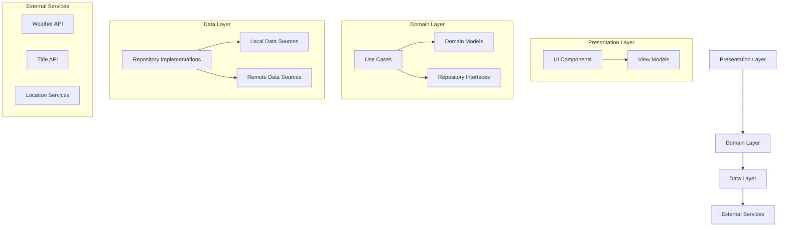

# Design Document: Salmon Trolling Assistant

## Overview

The Salmon Trolling Assistant is a native mobile application designed to help fishermen optimize their salmon trolling equipment choices based on current and forecasted weather and tide conditions. The app will provide real-time recommendations for flashers, lures, and leader lengths tailored to specific fishing conditions, with the goal of improving catch rates through data-driven suggestions.

This design document outlines the architecture, components, data models, and other technical aspects of the application to guide its implementation.

## Architecture

The application will follow a clean architecture pattern with clear separation of concerns:



### Key Architectural Decisions:

1. **Native Mobile Development**: The application will be developed as native mobile apps for iOS and Android to ensure optimal performance and user experience.
   - iOS: Swift with SwiftUI
   - Android: Kotlin with Jetpack Compose

2. **Offline-First Approach**: The app will cache data locally to ensure functionality in areas with limited connectivity.

3. **Reactive Programming**: The application will use reactive programming patterns to handle asynchronous data streams from APIs and user interactions.

4. **Dependency Injection**: A dependency injection framework will be used to manage component dependencies and facilitate testing.

## Components and Interfaces

### 1. Core Components

#### 1.1 User Interface Components

The UI will be organized into the following main screens:

1. **Home Screen**
   - Current weather and tide conditions
   - Quick access to recommendations
   - Saved locations
   - Date/time selector for planning

2. **Recommendation Screen**
   - Flasher recommendations
   - Lure recommendations
   - Leader length recommendations
   - Filtering options by fish species

3. **Weather & Tide Detail Screen**
   - Detailed weather forecast
   - Tide charts and predictions
   - Historical data comparison

4. **Location Management Screen**
   - Current location detection
   - Saved locations list
   - Location search and map view

5. **User Profile Screen**
   - User preferences
   - Equipment inventory
   - Catch history
   - Settings

#### 1.2 Service Interfaces

```
interface WeatherService {
    suspend fun getCurrentWeather(location: Location): Result<WeatherData>
    suspend fun getForecast(location: Location, days: Int): Result<List<WeatherData>>
    suspend fun getWeatherForDateTime(location: Location, dateTime: DateTime): Result<WeatherData>
}

interface TideService {
    suspend fun getCurrentTide(location: Location): Result<TideData>
    suspend fun getTidePredictions(location: Location, days: Int): Result<List<TideData>>
    suspend fun getTideForDateTime(location: Location, dateTime: DateTime): Result<TideData>
}

interface LocationService {
    suspend fun getCurrentLocation(): Result<Location>
    suspend fun searchLocations(query: String): Result<List<Location>>
    fun getSavedLocations(): Flow<List<Location>>
    suspend fun saveLocation(location: Location): Result<Boolean>
    suspend fun deleteLocation(locationId: String): Result<Boolean>
}

interface RecommendationEngine {
    fun getRecommendations(
        weatherData: WeatherData,
        tideData: TideData,
        fishSpecies: FishSpecies?,
        userPreferences: UserPreferences?
    ): List<EquipmentRecommendation>
}

interface UserProfileService {
    fun getUserProfile(): Flow<UserProfile?>
    suspend fun updateUserProfile(profile: UserProfile): Result<Boolean>
    suspend fun logCatch(catchData: CatchData): Result<Boolean>
    fun getCatchHistory(): Flow<List<CatchData>>
}
```

### 2. External API Integration

The application will integrate with the following external APIs:

1. **Weather API** (e.g., OpenWeatherMap, Weather API)
   - Current conditions
   - Hourly and daily forecasts
   - Marine-specific data (wind speed, wave height, etc.)

2. **Tide API** (e.g., NOAA Tides & Currents, WorldTides API)
   - Current tide status
   - Tide predictions
   - Tide charts and graphs

3. **Mapping Services** (e.g., Google Maps, MapBox)
   - Location search
   - Map visualization
   - Geolocation services

## Data Models

### Core Domain Models

```
data class Location(
    val id: String,
    val name: String,
    val latitude: Double,
    val longitude: Double,
    val isSaved: Boolean = false,
    val notes: String? = null
)

data class WeatherData(
    val timestamp: Long,
    val temperature: Double,
    val windSpeed: Double,
    val windDirection: String,
    val precipitation: Double,
    val cloudCover: Int,
    val visibility: Double,
    val pressure: Double,
    val humidity: Int,
    val uvIndex: Int,
    val waterTemperature: Double?
)

data class TideData(
    val timestamp: Long,
    val height: Double,
    val type: TideType, // HIGH, LOW, RISING, FALLING
    val nextHighTide: TideEvent?,
    val nextLowTide: TideEvent?
)

data class TideEvent(
    val timestamp: Long,
    val height: Double
)

enum class TideType {
    HIGH, LOW, RISING, FALLING
}

data class EquipmentRecommendation(
    val type: EquipmentType,
    val items: List<EquipmentItem>,
    val reasonForRecommendation: String,
    val confidenceScore: Float
)

enum class EquipmentType {
    FLASHER, LURE, LEADER
}

data class EquipmentItem(
    val id: String,
    val name: String,
    val description: String,
    val imageUrl: String?,
    val specifications: Map<String, String>
)

enum class FishSpecies {
    CHINOOK, COHO, SOCKEYE, PINK, CHUM
}

data class UserProfile(
    val id: String,
    val name: String?,
    val preferences: UserPreferences,
    val equipmentInventory: List<UserEquipment>
)

data class UserPreferences(
    val preferredSpecies: List<FishSpecies>,
    val preferredEquipment: List<String>, // IDs of preferred equipment
    val experienceLevel: ExperienceLevel,
    val notificationSettings: NotificationSettings
)

enum class ExperienceLevel {
    BEGINNER, INTERMEDIATE, ADVANCED, EXPERT
}

data class UserEquipment(
    val id: String,
    val equipmentId: String,
    val notes: String?
)

data class CatchData(
    val id: String,
    val timestamp: Long,
    val location: Location,
    val species: FishSpecies,
    val size: Double?, // in inches or cm
    val weight: Double?, // in pounds or kg
    val equipmentUsed: List<String>, // IDs of equipment used
    val weatherConditions: WeatherData,
    val tideConditions: TideData,
    val notes: String?,
    val photoUrls: List<String>?
)

data class NotificationSettings(
    val enableWeatherAlerts: Boolean,
    val enableTideAlerts: Boolean,
    val enableOptimalConditionAlerts: Boolean
)
```

## Recommendation Algorithm

The recommendation engine will use a rule-based system combined with machine learning to provide equipment suggestions based on environmental conditions:

1. **Rule-Based System**:
   - Initial recommendations based on predefined rules for different conditions
   - Example: "Clear water + bright sun = use smaller, less flashy lures"
   - Example: "Cloudy water + overcast = use larger, more visible flashers"

2. **Machine Learning Enhancement** (future phase):
   - Train models based on user catch data and conditions
   - Improve recommendations over time based on successful catches
   - Personalize recommendations based on user history and preferences

### Recommendation Factors:

- Weather conditions (cloud cover, precipitation, wind)
- Water conditions (clarity, temperature, current)
- Tide status (high, low, rising, falling)
- Time of day (dawn, day, dusk, night)
- Season and fish run timing
- User's past successful combinations
- Local fishing reports and trends

## Data Storage

### Local Storage

The application will use a combination of storage mechanisms:

1. **SQLite Database**:
   - User profile information
   - Saved locations
   - Catch history
   - Equipment inventory

2. **Key-Value Storage**:
   - App settings
   - User preferences
   - Authentication tokens

3. **File Storage**:
   - Cached images
   - Offline maps
   - User-captured photos

### Cloud Storage (Optional future feature)

For users who opt into cloud sync:

1. **User Data**:
   - Profile information
   - Preferences
   - Catch history

2. **Analytics Data**:
   - Anonymized catch data for improving recommendations
   - Usage patterns for app improvement

## Error Handling

The application will implement a comprehensive error handling strategy:

1. **Network Errors**:
   - Graceful degradation to offline mode
   - Clear user messaging about connectivity issues
   - Automatic retry mechanisms with exponential backoff
   - Background synchronization when connectivity is restored

2. **API Errors**:
   - Fallback to cached data
   - Informative error messages
   - Alternative data sources when available

3. **Location Services Errors**:
   - Prompt for manual location entry
   - Clear instructions for enabling location services
   - Fallback to last known location

4. **Data Validation Errors**:
   - Input validation before submission
   - Clear error messaging for invalid inputs
   - Suggestions for correction

## Testing Strategy

### Unit Testing

- Test individual components in isolation
- Mock dependencies for controlled testing
- Focus on business logic and data transformations
- Target 80%+ code coverage

### Integration Testing

- Test interactions between components
- Verify API integration with mock servers
- Test database operations and migrations
- Validate offline/online transitions

### UI Testing

- Automated UI tests for critical paths
- Accessibility testing
- Cross-device testing
- Performance testing under various conditions

### User Testing

- Beta testing with actual fishermen
- A/B testing for UI improvements
- Usability testing in realistic conditions (bright sunlight, wet hands)

## Security Considerations

1. **Data Protection**:
   - Encrypt sensitive user data
   - Secure API keys and credentials
   - Implement proper authentication for cloud features

2. **Privacy**:
   - Clear privacy policy
   - Granular permission controls
   - Option to use app without account creation
   - Anonymous usage analytics

3. **Location Data**:
   - Request location only when needed
   - Option for approximate location
   - Clear indication when location is being accessed

## Accessibility

The application will be designed with accessibility in mind:

1. **Visual Accessibility**:
   - High contrast mode
   - Adjustable text sizes
   - Screen reader compatibility
   - Color blindness considerations

2. **Physical Accessibility**:
   - Large touch targets
   - Voice commands (future feature)
   - Minimal reliance on complex gestures

## Performance Optimization

1. **Battery Usage**:
   - Efficient location polling
   - Batch network requests
   - Optimize background processes

2. **Data Usage**:
   - Compress API requests/responses
   - Configurable data usage limits
   - Prefetch data when on WiFi

3. **App Size and Loading**:
   - Optimize asset sizes
   - Progressive loading of non-critical features
   - Efficient caching strategies

## Deployment Strategy

1. **Platform Distribution**:
   - iOS: Apple App Store
   - Android: Google Play Store

2. **Release Management**:
   - Phased rollouts
   - Beta testing program
   - Feature flags for gradual feature introduction

3. **Monitoring**:
   - Crash reporting
   - Performance monitoring
   - Usage analytics

## Future Enhancements

1. **Social Features**:
   - Sharing catch information
   - Community fishing reports
   - Leaderboards and achievements

2. **Advanced Analytics**:
   - Seasonal trend analysis
   - Personal performance statistics
   - Predictive catch forecasting

3. **Hardware Integration**:
   - Fish finder connectivity
   - Weather station integration
   - Smart tackle box tracking