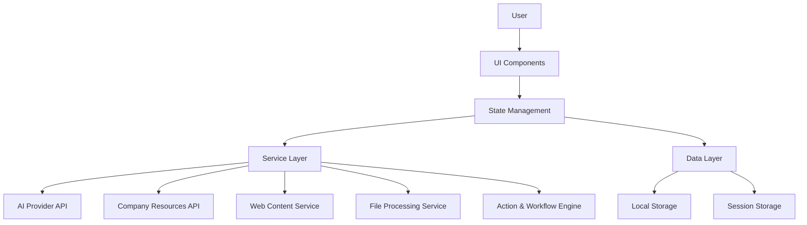
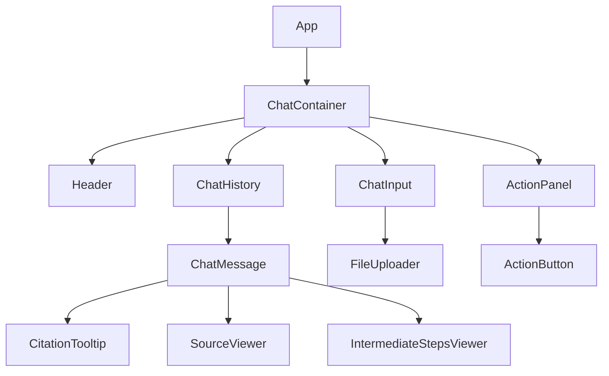

# Design Document: Gen AI Chat Assistant

## Overview

The Gen AI Chat Assistant is a React-based conversational interface that enables users to interact with AI models, company resources, and web content through a unified chat experience. The application will build upon the existing React project structure, enhancing it with new components and services to support advanced features like file uploads, citation viewing, source verification, and multiple UI modes.

The design follows a component-based architecture with clear separation of concerns between UI components, data management, and service integrations. The system will use modern React patterns including hooks, context API, and modular CSS to ensure maintainability and scalability.

## Architecture

The Gen AI Chat Assistant will follow a layered architecture:

1. **Presentation Layer**: React components for UI rendering
2. **State Management Layer**: React Context API and hooks for state management
3. **Service Layer**: API clients and service integrations
4. **Data Layer**: Data models and persistence

### High-Level Architecture Diagram



## Components and Interfaces

### Core Components

1. **ChatContainer**: Main container component that orchestrates the chat experience
2. **ChatHistory**: Enhanced version of the existing component to support citations and intermediate steps
3. **ChatMessage**: Enhanced to support citations, sources, and rich content
4. **ChatInput**: Enhanced with file upload capabilities and action triggers
5. **SourceViewer**: New component for displaying source information
6. **CitationTooltip**: New component for displaying citation information on hover
7. **FileUploader**: New component for handling file uploads
8. **ActionPanel**: New component for displaying and triggering actions
9. **IntermediateStepsViewer**: New component for displaying reasoning steps
10. **UIModeSwitcher**: New component for switching between focus and compact modes

### Component Hierarchy



### Key Interfaces

#### Message Interface

```typescript
interface Message {
  id: string;
  text: string;
  isUser: boolean;
  timestamp: Date;
  citations?: Citation[];
  intermediateSteps?: Step[];
  actions?: Action[];
}

interface Citation {
  id: number;
  text: string;
  source: Source;
}

interface Source {
  type: 'web' | 'company' | 'file' | 'ai';
  title: string;
  url?: string;
  fileId?: string;
  location?: string; // Section/page in document
  snippet?: string; // Relevant text snippet
}

interface Step {
  id: number;
  description: string;
  content: string;
}

interface Action {
  id: string;
  name: string;
  description: string;
  parameters?: Record<string, any>;
  handler: () => void;
}
```

#### Service Interfaces

```typescript
interface AIService {
  generateResponse(prompt: string, options?: AIOptions): Promise<AIResponse>;
}

interface ResourceService {
  fetchResource(resourceId: string): Promise<Resource>;
}

interface WebContentService {
  fetchContent(url: string): Promise<WebContent>;
}

interface FileProcessingService {
  uploadFile(file: File): Promise<FileUploadResult>;
  processFile(fileId: string): Promise<FileProcessingResult>;
}

interface ActionService {
  getAvailableActions(context: ActionContext): Action[];
  executeAction(actionId: string, parameters: Record<string, any>): Promise<ActionResult>;
}

interface WorkflowService {
  getAvailableWorkflows(context: WorkflowContext): Workflow[];
  executeWorkflow(workflowId: string, parameters: Record<string, any>): Promise<WorkflowResult>;
}
```

## Data Models

### Core Data Models

```typescript
// User preferences
interface UserPreferences {
  uiMode: 'focus' | 'compact';
  showIntermediateSteps: boolean;
  theme: 'light' | 'dark' | 'system';
}

// Chat session
interface ChatSession {
  id: string;
  title: string;
  createdAt: Date;
  updatedAt: Date;
  messages: Message[];
  uploadedFiles: UploadedFile[];
}

// Uploaded file
interface UploadedFile {
  id: string;
  name: string;
  type: string;
  size: number;
  uploadedAt: Date;
  processingStatus: 'pending' | 'processing' | 'completed' | 'failed';
  processingError?: string;
  metadata?: Record<string, any>;
}
```

### State Management

The application will use React Context API to manage global state:

```typescript
// Chat context
interface ChatContextType {
  sessions: ChatSession[];
  currentSession: ChatSession | null;
  messages: Message[];
  isGenerating: boolean;
  uploadedFiles: UploadedFile[];
  sendMessage: (text: string) => void;
  uploadFile: (file: File) => Promise<void>;
  clearHistory: () => void;
  createNewSession: () => void;
  switchSession: (sessionId: string) => void;
}

// UI context
interface UIContextType {
  mode: 'focus' | 'compact';
  showIntermediateSteps: boolean;
  setMode: (mode: 'focus' | 'compact') => void;
  toggleIntermediateSteps: () => void;
}
```

## Service Integration

### AI Provider Integration

The system will integrate with LLM providers through a unified API client:

```typescript
class AIProviderClient {
  constructor(providerConfig) {
    this.config = providerConfig;
  }

  async generateResponse(prompt, options) {
    // Implementation details
  }

  async streamResponse(prompt, options, callback) {
    // Implementation for streaming responses
  }
}
```

### Company Resource Integration

Integration with company resources will be handled through a dedicated service:

```typescript
class CompanyResourceService {
  constructor(authToken) {
    this.authToken = authToken;
  }

  async fetchDashboard(dashboardId) {
    // Implementation details
  }

  async fetchReport(reportId) {
    // Implementation details
  }

  async fetchSpace(spaceId) {
    // Implementation details
  }
}
```

### Web Content Integration

Web content will be fetched and processed through a dedicated service:

```typescript
class WebContentService {
  async fetchContent(url) {
    // Implementation details
  }

  async summarizeContent(content) {
    // Implementation details
  }
}
```

### File Processing Integration

File processing will be handled through a dedicated service:

```typescript
class FileProcessingService {
  async uploadFile(file) {
    // Implementation details
  }

  async processFile(fileId) {
    // Implementation details
  }

  async extractText(fileId) {
    // Implementation details
  }

  async generateEmbeddings(fileId) {
    // Implementation details
  }
}
```

## Error Handling

The system will implement a comprehensive error handling strategy:

1. **User-Facing Errors**: Friendly error messages with actionable information
2. **Service Errors**: Detailed logging with retry mechanisms
3. **Network Errors**: Offline support and reconnection strategies
4. **Input Validation**: Client-side validation with helpful feedback

Error handling will be implemented through:

```typescript
class ErrorHandler {
  static handleError(error, context) {
    // Log error
    console.error(`Error in ${context}:`, error);

    // Determine error type
    if (error.isNetworkError) {
      return {
        userMessage: "Network connection issue. Please check your internet connection.",
        recoverable: true,
        retryAction: () => { /* retry logic */ }
      };
    }

    if (error.isServiceError) {
      return {
        userMessage: "Service temporarily unavailable. Please try again later.",
        recoverable: true,
        retryAction: () => { /* retry logic */ }
      };
    }

    // Default error handling
    return {
      userMessage: "Something went wrong. Please try again.",
      recoverable: false
    };
  }
}
```

## Testing Strategy

The testing strategy will include:

1. **Unit Tests**: For individual components and services
2. **Integration Tests**: For component interactions and service integrations
3. **End-to-End Tests**: For critical user flows
4. **Accessibility Tests**: To ensure the application is accessible to all users

### Unit Testing

Unit tests will be implemented using Jest and React Testing Library:

```typescript
// Example test for ChatMessage component
test('ChatMessage renders citations correctly', () => {
  const message = {
    text: 'This is a message with a citation[1].',
    isUser: false,
    citations: [
      {
        id: 1,
        text: 'Source information',
        source: {
          type: 'web',
          title: 'Example Website',
          url: 'https://example.com'
        }
      }
    ]
  };

  render(<ChatMessage message={message} />);
  expect(screen.getByText(/This is a message with a citation/)).toBeInTheDocument();
  expect(screen.getByText('[1]')).toBeInTheDocument();
});
```

### Integration Testing

Integration tests will focus on component interactions:

```typescript
// Example integration test for chat flow
test('User can send a message and receive a response', async () => {
  // Mock AI service
  const mockAIService = {
    generateResponse: jest.fn().mockResolvedValue({
      text: 'This is a response',
      citations: []
    })
  };

  render(
    <ServiceContext.Provider value={{ aiService: mockAIService }}>
      <ChatContainer />
    </ServiceContext.Provider>
  );

  // Type and send a message
  const input = screen.getByPlaceholderText('Ask a question');
  fireEvent.change(input, { target: { value: 'Hello' } });
  fireEvent.click(screen.getByRole('button', { name: /send/i }));

  // Verify the message was sent
  expect(screen.getByText('Hello')).toBeInTheDocument();

  // Wait for and verify the response
  await waitFor(() => {
    expect(screen.getByText('This is a response')).toBeInTheDocument();
  });
});
```

## Implementation Considerations

### Performance Optimization

1. **Virtualized Lists**: For efficient rendering of large chat histories
2. **Lazy Loading**: For components and resources
3. **Memoization**: To prevent unnecessary re-renders
4. **Web Workers**: For heavy processing tasks

### Accessibility

1. **ARIA Attributes**: For screen reader support
2. **Keyboard Navigation**: For all interactive elements
3. **Color Contrast**: For readability
4. **Focus Management**: For keyboard users

### Security

1. **Input Sanitization**: To prevent XSS attacks
2. **Content Security Policy**: To restrict resource loading
3. **Authentication**: For secure access to company resources
4. **Data Encryption**: For sensitive information

### Internationalization

1. **Text Externalization**: For easy translation
2. **RTL Support**: For right-to-left languages
3. **Date and Number Formatting**: For locale-specific formatting

## Design Decisions and Rationales

### Why React Context API for State Management?

The application's state management needs are moderate in complexity. React Context API provides a built-in solution that avoids additional dependencies while offering sufficient capabilities for our needs. For more complex state management requirements in the future, we can consider Redux or MobX.

### Why Streaming Responses?

Streaming responses provides a more engaging user experience by showing progress and reducing perceived latency. It also allows for displaying intermediate steps during response generation, which enhances transparency and trust.

### Why Separate Service Classes?

Separating service integrations into dedicated classes improves maintainability and testability. It also allows for easier replacement or modification of individual services without affecting the rest of the application.

### Why Focus and Compact UI Modes?

Different users have different preferences and needs. Focus mode helps users concentrate on the conversation, while compact mode is useful for multitasking or smaller screens. This flexibility enhances the user experience across different contexts.